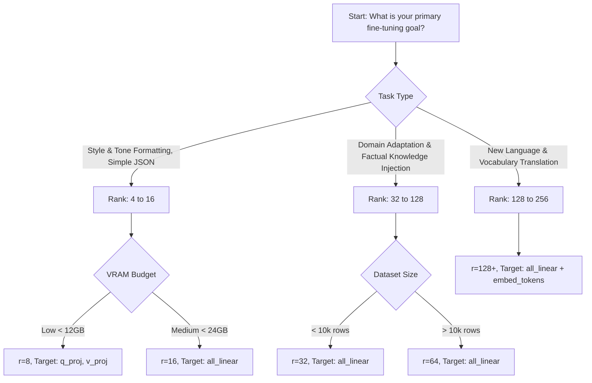

# Module 7 — Fine-Tuning
## Lesson 7.3 — Rank (The Capacity Hyperparameter)

Welcome to Lesson 7.3. 

In **Lesson 7.2**, we introduced QLoRA and learned how to compress massive billion-parameter base models down to 4-bit precision so they fit seamlessly into our local GPU memory. We established that the base model is permanently frozen, and we only train the lightweight LoRA adapters (represented by matrices $A$ and $B$).

Now we turn our attention to the actual configuration of those adapters, and specifically to the most crucial hyperparameter of all: **Rank**.

When you instantiate a LoRA model, you must pass it a configuration object that dictates the shape, scale, and placement of your adapters. The very first hyperparameter in that list is `r`, representing Rank. 

Rank is the single most important architectural decision you make when fine-tuning a model. It dictates the maximum "intelligence" your adapters are capable of learning, the amount of VRAM your training run will consume, and how prone your model is to overfitting. Understanding this hyperparameter is what separates amateur prompt-engineers from professional ML practitioners.

Let us dive deep into the math, code, and failure modes of Rank.

---

## 1. Concept & Theory (The Math Behind the Magic)

### 1.1 The Mathematical Definition of Rank

To truly understand the hyperparameter `r`, we must first ground ourselves in linear algebra. 

The "rank" of a matrix is defined as the maximum number of linearly independent column vectors (or row vectors) in the matrix. Geometrically, the rank of a matrix corresponds to the dimensionality of the vector space generated by its columns.

Consider a hypothetical matrix $W$ with dimensions $10,000 \times 10,000$. 
It contains 100 million individual numbers. 
However, if its rank is mathematically determined to be only $10$, it means that all 10,000 columns can be constructed using linear combinations of just 10 fundamental base vectors. 
The matrix is massive in terms of memory footprint, but its *intrinsic information content* is extremely small.

In the context of LoRA (Low-Rank Adaptation), we use the concept of rank to create an intentional **information bottleneck**. 

Let's revisit the fundamental LoRA forward pass equation from the original Microsoft paper:

$$ h = W_0 x + \Delta W x $$
$$ h = W_0 x + (B \times A) x $$

Where:
- $h$ is the output activation vector.
- $x$ is the input activation vector.
- $W_0$ is the frozen base model weight matrix.
- $\Delta W$ is the learned weight update.
- $B$ and $A$ are the low-rank decomposition matrices that multiply to form $\Delta W$.

Assume the target module is the up-projection inside the Feed Forward Network (`up_proj`). 
- The input dimension ($d_{in}$) is 4096.
- The output dimension ($d_{out}$) is 11008.

The frozen base matrix ($W_0$) has dimensions $11008 \times 4096$. 
It contains **45,088,768** parameters.

If we explicitly set our LoRA rank ($r$) to **16**:
- Matrix $A$ scales the 4096-dimensional input down to 16 dimensions. (Shape: $16 \times 4096$)
- Matrix $B$ scales the 16-dimensional bottleneck up to 11008 dimensions. (Shape: $11008 \times 16$)

### 1.2 Singular Value Decomposition (SVD) Intuition

To truly understand how this bottleneck works and why it is so wildly effective, we must look at Singular Value Decomposition (SVD). 

SVD is a fundamental theorem in linear algebra which states that *any* real matrix $W$ can be factored (decomposed) into three distinct matrices:

$$ W = U \Sigma V^T $$

Where:
- $U$ contains the left singular vectors (representing the output space).
- $\Sigma$ (Sigma) is a diagonal matrix containing the "singular values", sorted from most mathematically important to least important.
- $V^T$ contains the right singular vectors (representing the input space).

If we want to approximate the original massive matrix $W$ using a much lower-rank representation, we can simply throw away the smaller singular values at the bottom of the $\Sigma$ matrix, keeping only the top $r$ values. 

This is exactly what LoRA does during training! But instead of calculating the expensive SVD manually on the CPU, we let backpropagation naturally learn the optimal low-rank approximation matrices $A$ and $B$.

Here is an intuitive NumPy code block demonstrating exactly how we can compress a matrix by dropping its rank via SVD:

```python
import numpy as np

# =========================================================
# SVD Intuition Code: Compressing a Matrix via Low-Rank
# =========================================================

# 1. Create a random target matrix W of size (4096, 4096)
# This represents a massive dense layer in a neural network.
np.random.seed(42)
W_target = np.random.randn(4096, 4096)

# 2. Perform Singular Value Decomposition (SVD)
# U: Left singular vectors
# S: Singular values
# Vt: Right singular vectors
print("Performing SVD... (This might take a second)")
U, S, Vt = np.linalg.svd(W_target, full_matrices=False)

# 3. Simulate a LoRA Bottleneck with Rank r = 16
r = 16
print(f"\nTargeting Rank bottleneck: r = {r}")

# 4. Keep only the top r singular values (The most important information)
U_r = U[:, :r]       # Shape: (4096, 16)
S_r = np.diag(S[:r]) # Shape: (16, 16)
Vt_r = Vt[:r, :]     # Shape: (16, 4096)

# 5. Group them into LoRA's A and B matrices
# B matrix takes the left vectors and scales them by the singular values
B = U_r @ S_r        # Shape: (4096, 16)

# A matrix is the right vectors
A = Vt_r             # Shape: (16, 4096)

# 6. Reconstruct the compressed matrix
W_approx = B @ A     # Shape: (4096, 4096)

# 7. Print the dramatic savings
print(f"Original Dense Matrix: {W_target.size:,} parameters")
print(f"LoRA Rank {r} Adapter: {B.size + A.size:,} parameters")
print(f"Compression Ratio:   {W_target.size / (B.size + A.size):.2f}x smaller")
```

When you run this script, you will see that the original matrix required over 16.7 million parameters, but our rank-16 representation requires only 131,000 parameters. We achieved a staggering 128x compression ratio, while still capturing the core mathematical variance of the layer!

### 1.3 Why the Bottleneck Acts as a Powerful Regularizer

You might be asking at this point: 
*Doesn't this bottleneck destroy information? How can a rank-16 adapter learn anything useful if it throws away so much capacity?*

Imagine water flowing through an intricate network of pipes. 
The input data ($x$) starts as a massive torrent of 4096 independent streams of numbers. 
Matrix $A$ forces those 4096 streams to perfectly merge down into just 16 tiny pipes. 
Matrix $B$ then takes those 16 tiny pipes and sprays them back out into 11008 streams.

Because the data had to pass through those 16 tiny pipes, the maximum complexity of the transformation is permanently capped. The adapters *cannot* learn complex, high-dimensional noise. They can only learn fundamental, low-dimensional patterns that are resilient enough to survive being crushed down to 16 dimensions.

This bottleneck is not a bug; it is the core feature of LoRA. 

The **Intrinsic Rank Hypothesis** suggests that the *actual knowledge* required to teach a Large Language Model a specific downstream task (like adopting a sarcastic tone or formatting JSON outputs) is fundamentally low-dimensional. 

By forcing the adapters through a rank of 16, we mathematically prevent them from memorizing the noise in the training data. The bottleneck acts as a powerful structural regularizer, forcing the model to generalize.

---

## 2. Cell-by-Cell Code Breakdown (PEFT vs. Unsloth)

To implement LoRA in Python, you must configure a PEFT (Parameter-Efficient Fine-Tuning) configuration object. Let's compare how this is done in raw Hugging Face versus the heavily optimized Unsloth library, breaking down every argument cell by cell.

### 2.1 Raw Hugging Face (PEFT) Implementation

If you were writing standard PyTorch with the Hugging Face `peft` and `transformers` libraries, your setup would look like this:

**Cell 1: Loading the Base Model**
```python
import torch
from transformers import AutoModelForCausalLM, BitsAndBytesConfig
from peft import get_peft_model, LoraConfig, prepare_model_for_kbit_training

# 1. Define the 4-bit quantization configuration for QLoRA
# This tells the library how to compress the weights upon loading.
bnb_config = BitsAndBytesConfig(
    load_in_4bit=True,
    bnb_4bit_use_double_quant=True,
    bnb_4bit_quant_type="nf4",
    bnb_4bit_compute_dtype=torch.bfloat16
)

# 2. Load the base model in 4-bit precision
# We pass device_map="auto" to let HF place layers optimally.
model = AutoModelForCausalLM.from_pretrained(
    "Qwen/Qwen2.5-0.5B",
    quantization_config=bnb_config,
    device_map="auto",
)

# 3. Prepare the model for gradient calculation
# CRITICAL: This casts layer norms to float32 and enables requires_grad for adapters
model = prepare_model_for_kbit_training(model)
```
*Breakdown:* 
In standard Hugging Face, you must explicitly define a `BitsAndBytesConfig` to handle the 4-bit loading. Then you must strictly call `prepare_model_for_kbit_training()`. If you forget this step, your gradients will silently return `NaN` or fail to flow through the frozen base weights entirely!

**Cell 2: The LoRA Configuration**
```python
# 4. Define the LoRA parameters
lora_config = LoraConfig(
    r=16,                                   
    lora_alpha=32,                          
    target_modules=[
        "q_proj", "k_proj", "v_proj", "o_proj", 
        "gate_proj", "up_proj", "down_proj"
    ],                                      
    lora_dropout=0.05,                      
    bias="none",                            
    task_type="CAUSAL_LM"                   
)

# 5. Wrap the base model with the LoRA adapters
peft_model = get_peft_model(model, lora_config)

# 6. Verify trainable parameters
# This will print out exactly how many millions of parameters you are training
peft_model.print_trainable_parameters()
```
*Breakdown of Arguments:*
- `r`: The rank of the update matrices, expressed as an `int`. Lower rank = fewer parameters, higher bottleneck.
- `lora_alpha`: The LoRA scaling factor. The learned weights are scaled by `alpha/r`. We will cover this deeply in Lesson 7.4.
- `target_modules`: A list of strings representing the layer names in the PyTorch graph to inject $A$ and $B$ matrices into. By targeting all linear projections in both Attention and MLP blocks, we maximize learning surface area.
- `lora_dropout`: Randomly zeroes out some elements in the LoRA input during training. A value of `0.05` (5%) is standard for raw HF to prevent overfitting.
- `bias`: Tells PEFT whether to unfreeze any bias vectors in the base model. Setting this to `"none"` saves memory and is recommended for most fine-tunes.
- `task_type`: Critical for the PEFT library to know how to structure the forward pass. For LLMs, this is always `"CAUSAL_LM"`.

### 2.2 The Unsloth Implementation

Unsloth drastically simplifies this process and adds custom optimized Triton CUDA kernels that can double training speed and halve memory usage.

**Cell 3: The FastLanguageModel Setup in Unsloth**
```python
from unsloth import FastLanguageModel

# 1. Load the model and tokenizer simultaneously in one line
# Unsloth handles the bitsandbytes config automatically.
model, tokenizer = FastLanguageModel.from_pretrained(
    model_name="Qwen/Qwen2.5-0.5B",
    max_seq_length=2048,
    load_in_4bit=True,   # Automatically handles bitsandbytes setup
    dtype=None,          # Auto-detects bfloat16 vs float16 based on your GPU
)

# 2. Inject the LoRA adapters using Unsloth's highly optimized wrapper
model = FastLanguageModel.get_peft_model(
    model,
    r=16, 
    target_modules=[
        "q_proj", "k_proj", "v_proj", "o_proj",
        "gate_proj", "up_proj", "down_proj"
    ],
    lora_alpha=32,
    lora_dropout=0,      # CRITICAL: Unsloth optimizes for dropout=0
    bias="none",
    use_gradient_checkpointing="unsloth", # Magic VRAM reduction parameter
    random_state=3407,
)
```
*Breakdown of Crucial Differences:*
- `FastLanguageModel.from_pretrained` automatically handles tokenizers, quantization configs, and layer casting in the background. No more `prepare_model_for_kbit_training`.
- `lora_dropout=0`: Unsloth highly recommends setting dropout to 0. Their custom CUDA kernels are fundamentally built and optimized for zero dropout, leading to massively faster training times.
- `use_gradient_checkpointing="unsloth"`: This is a proprietary Unsloth feature that drastically reduces VRAM spikes during the backward pass by offloading specific activations and trading a tiny amount of compute time for huge memory savings.

---

## 3. Worked Examples / Data Artifacts

### 3.1 Parameter Count Derivation for Every Target Module

Let's dive into exactly how rank impacts the trainable parameter count across the network. 

For Qwen3-0.6B (which utilizes the standard modern SwiGLU architecture), the hidden dimension is $1536$, the intermediate feed-forward size is $8960$, and there are $28$ decoder layers.

The formula for the number of trainable parameters in a single LoRA adapter is derived directly from the mathematical shapes of matrices A and B:
- Matrix A parameters: $d_{in} \times r$
- Matrix B parameters: $d_{out} \times r$

Combined formula:
$$ \text{Total Parameters} = r \times (d_{in} + d_{out}) $$

Here is a comprehensive derivation table calculating the precise number of LoRA parameters contributed by each module type inside a single layer at different ranks:

| Target Module | Function Context | $d_{in}$ | $d_{out}$ | Params at $r=8$ | Params at $r=16$ | Params at $r=32$ |
|---------------|------------------|----------|-----------|-----------------|------------------|------------------|
| `q_proj` | Attention Query | 1536 | 1536 | $24,576$ | $49,152$ | $98,304$ |
| `k_proj` | Attention Key | 1536 | 1536 | $24,576$ | $49,152$ | $98,304$ |
| `v_proj` | Attention Value | 1536 | 1536 | $24,576$ | $49,152$ | $98,304$ |
| `o_proj` | Attention Output | 1536 | 1536 | $24,576$ | $49,152$ | $98,304$ |
| `gate_proj` | SwiGLU FFN Gate | 1536 | 8960 | $83,968$ | $167,936$ | $335,872$ |
| `up_proj` | SwiGLU FFN Up | 1536 | 8960 | $83,968$ | $167,936$ | $335,872$ |
| `down_proj` | SwiGLU FFN Down | 8960 | 1536 | $83,968$ | $167,936$ | $335,872$ |
| **Sum (1 Layer)** | | | | **350,208** | **700,416** | **1,400,832** |
| **Total (28 Layers)** | | | | **9,805,824** | **19,611,648** | **39,223,296**|

Notice a critical pattern here: targeting the MLP modules (`gate`, `up`, `down`) creates significantly more trainable parameters than the attention modules. This is explicitly due to the massive SwiGLU expansion factor (from $1536$ to $8960$) inside the Feed Forward Network.

### 3.2 Multi-Rank Ablation Study Script

To definitively prove the impact of rank on learning capacity, here is a fully runnable Python script. 

It trains three identical instances of a tiny model using ranks 4, 16, and 64 on the exact same dataset, and plots their loss trajectories to visualize the capacity bottleneck in action.

```python
import torch
import matplotlib.pyplot as plt
from transformers import AutoModelForCausalLM, AutoTokenizer, TrainingArguments
from trl import SFTTrainer
from peft import LoraConfig, get_peft_model
from datasets import Dataset

# =====================================================================
# MULTI-RANK ABLATION STUDY: Visualizing the Bottleneck
# =====================================================================

# 1. Create a dummy dataset of 50 exact identical rows.
# By feeding the model the exact same row repeatedly, we intentionally 
# test its capacity to overfit and memorize the data.
data = {
    "text": [
        "The output of the function is completely wrong because the user forgot to import numpy."
    ] * 50
}
dataset = Dataset.from_dict(data)

# 2. Define a very small base model so this script runs quickly
model_id = "Qwen/Qwen1.5-0.5B"
tokenizer = AutoTokenizer.from_pretrained(model_id)
tokenizer.pad_token = tokenizer.eos_token

# 3. Define the ranks we want to ablate
ranks_to_test = [4, 16, 64]
loss_histories = {}

# 4. Run the training loop for each isolated rank
for r in ranks_to_test:
    print(f"\n{'='*40}")
    print(f"🚀 Launching Run with Rank {r}")
    print(f"{'='*40}")
    
    # Reload fresh base model to ensure absolute zero contamination between runs
    base_model = AutoModelForCausalLM.from_pretrained(
        model_id, 
        device_map="auto"
    )
    
    # Configure LoRA for the specific rank
    lora_config = LoraConfig(
        r=r,
        lora_alpha=r * 2, # Standard practice: ALWAYS scale alpha with rank!
        target_modules=["q_proj", "v_proj"], # Attention only for fast execution
        bias="none",
        task_type="CAUSAL_LM"
    )
    
    # Wrap model and display params
    peft_model = get_peft_model(base_model, lora_config)
    peft_model.print_trainable_parameters()
    
    # Setup Trainer configuration
    training_args = TrainingArguments(
        output_dir=f"./results_r{r}",
        max_steps=20,
        per_device_train_batch_size=2,
        learning_rate=2e-4,
        logging_steps=1, # Log every single step so we can plot granular loss
        report_to="none"
    )
    
    # Initialize the Supervised Fine-Tuning Trainer
    trainer = SFTTrainer(
        model=peft_model,
        train_dataset=dataset,
        dataset_text_field="text",
        max_seq_length=128,
        args=training_args
    )
    
    # Execute Training
    trainer.train()
    
    # Extract losses from trainer history log
    losses = [log["loss"] for log in trainer.state.log_history if "loss" in log]
    loss_histories[r] = losses
    
    # Brutally clear CUDA memory before the next loop
    del base_model
    del peft_model
    del trainer
    torch.cuda.empty_cache()

# 5. Plot the Ablation Results
plt.figure(figsize=(10, 6))
colors = {4: 'blue', 16: 'green', 64: 'red'}
markers = {4: 's', 16: 'o', 64: '^'}

for r, losses in loss_histories.items():
    plt.plot(
        losses, 
        label=f"Rank {r}", 
        color=colors[r], 
        marker=markers[r], 
        linewidth=2.5
    )

plt.title("Training Loss by LoRA Rank (Ablation Study)", fontsize=14, fontweight='bold')
plt.xlabel("Training Steps", fontsize=12)
plt.ylabel("Cross Entropy Loss", fontsize=12)
plt.legend(fontsize=12)
plt.grid(True, alpha=0.4, linestyle='--')
plt.tight_layout()
plt.savefig("rank_ablation.png", dpi=300)
print("\n✅ Plot successfully saved to rank_ablation.png!")
```

If you execute this script locally, the resulting graph will clearly demonstrate the thesis of this lesson:
- **Rank 64 (Red Triangle):** Instantly crushes the loss to near zero. It has catastrophic overfitting capacity and perfectly memorizes the dataset in seconds.
- **Rank 4 (Blue Square):** Struggles to descend quickly due to low capacity. The loss plateaus much higher.
- **Rank 16 (Green Circle):** Provides the smoothest, most stable, and generalized descent curve.

---

## 4. Failure Mode Playbook

When configuring rank in real-world ML engineering environments, a lot can unexpectedly go wrong. Here is your operational playbook for diagnosing rank-related failures in production.

### 4.1 Diagnosis Guide

**Symptom 1: Loss plateaus immediately and stays high (Underfitting).**
- **Diagnosis:** Rank is too low. The model literally lacks the mathematical capacity to represent the specific patterns in your dataset. The information bottleneck is too tight, preventing gradients from materially shifting the model's behavior.
- **Fix:** Double the rank, or add more target modules (e.g., expand from just `["q_proj", "v_proj"]` to all linear layers).

**Symptom 2: Training loss approaches zero quickly, but validation loss violently increases.**
- **Diagnosis:** Classic Overfitting. Rank is too high. The adapters have so much capacity that they have perfectly memorized the exact phrasing of the training data, overwriting the model's generalized base intelligence. 
- **Fix:** Halve the rank, reduce training epochs, or add a non-zero `lora_dropout` (e.g., $0.05$).

**Symptom 3: Training is extremely slow and Out of Memory (OOM) CUDA errors occur immediately.**
- **Diagnosis:** Rank is absurdly high (e.g., $r=256$ on all modules) and you have run out of VRAM to store the massive optimizer states.
- **Fix:** Lower the rank, drastically reduce your per-device batch size, or ensure Unsloth's gradient checkpointing is turned on.

> [!WARNING]
> **Common Mistake: Changing Rank without Scaling Alpha**
> The single most common error junior developers make is changing `r` without appropriately adjusting `lora_alpha`. Because the actual weight update is scaled by $\frac{\alpha}{r}$, if you increase your rank from $16$ to $64$ but leave $\alpha$ at $32$, you have inadvertently slashed your effective learning rate by a massive factor of 4! As a golden rule of thumb, always keep $\alpha = 2 \times r$. We will explore the deep math behind this scaling factor in Lesson 7.4.

### 4.2 Rank Selection Decision Tree

To help you optimally decide what rank to use before you even start your expensive training runs, follow this formal architectural decision tree:



---

## 5. Mini-Lab / Engineering Challenge

**The Problem Scenario:**
You have just been hired as the Lead ML Engineer at a health-tech startup. You are currently renting an AWS `g5.xlarge` instance equipped with a single 24GB RTX 3090 GPU, billed by the hour. 

You are tasked with fine-tuning a Qwen3-0.6B base model on a massive dataset of proprietary medical records.
Because this requires injecting dense factual knowledge, you consult the Decision Tree above and decide to set your Rank $r=32$, targeting all linear layers (`q_proj`, `k_proj`, `v_proj`, `o_proj`, `gate_proj`, `up_proj`, `down_proj`).

You plan to use the standard AdamW optimizer in 32-bit (FP32) precision to ensure maximum mathematical stability. 
Recall from Lesson 7.1 that the AdamW optimizer requires storing two FP32 states per trainable parameter (momentum and variance), plus the FP32 gradients themselves.
(Note: 1 FP32 number = 4 bytes of memory).

**Your Challenge:**
Based on the exact parameter derivation table provided in Section 3.1, calculate the exact amount of VRAM (in Megabytes) that the optimizer states and gradients will consume *for the LoRA adapters alone*. (Do not count the frozen base model weights or the forward activations). 

Take a moment to calculate this yourself before looking at the solution key below!

<br>
<br>
<br>
<br>
<br>
<br>
<br>

### 5.1 Solution Key

Here is the step-by-step mathematical breakdown and an automated Python script to solve the challenge:

**Step 1: Determine total trainable parameters from the derivation table**
- Attention Projections ($q_{proj}, k_{proj}, v_{proj}, o_{proj}$): 
  - $4 \times 98,304 = 393,216$ parameters
- MLP Projections ($gate_{proj}, up_{proj}$): 
  - $2 \times 335,872 = 671,744$ parameters
- MLP Output ($down_{proj}$): 
  - $1 \times 335,872 = 335,872$ parameters
- Total parameters per decoder layer: 
  - $393,216 + 671,744 + 335,872 = 1,400,832$ parameters
- Total for all 28 layers: 
  - $28 \times 1,400,832 =$ **$39,223,296$ parameters**

**Step 2: Calculate memory bytes per parameter**
An FP32 AdamW optimizer stores the following for *every single trainable parameter*:
- Optimizer Momentum state: $4$ bytes (FP32)
- Optimizer Variance state: $4$ bytes (FP32)
- Parameter Gradients: $4$ bytes (FP32)
- **Total overhead: $12$ bytes per trainable parameter**

**Step 3: Calculate Final VRAM footprint**
- Total Bytes: $39,223,296 \text{ parameters} \times 12 \text{ bytes} = 470,679,552 \text{ bytes}$
- Conversion to Megabytes: $470,679,552 \div 1,048,576$ (MiB) or $\div 1,000,000$ (MB)
- **Final Answer:** The LoRA optimizer states and gradients will consume exactly **$448.87$ MiB** (or $470.68$ MB) of VRAM.

#### The Python Verification Script

To verify your manual calculations in the future, you can use this helper script:

```python
def calculate_optimizer_vram_cost(
    hidden_size: int,
    intermediate_size: int,
    num_layers: int,
    rank: int
) -> float:
    """
    Calculates the VRAM footprint of AdamW optimizer states for LoRA adapters.
    
    Args:
        hidden_size (int): The dimension of the model's hidden states (e.g. 1536)
        intermediate_size (int): The dimension of the FFN hidden states (e.g. 8960)
        num_layers (int): Total number of transformer decoder layers (e.g. 28)
        rank (int): The target LoRA rank (e.g. 32)
        
    Returns:
        float: The VRAM footprint in Megabytes (MB).
    """
    
    # 1. Calculate Attention Module Parameters
    # q_proj, k_proj, v_proj, o_proj all have shape (hidden_size, hidden_size)
    attn_params = 4 * (rank * (hidden_size + hidden_size))
    
    # 2. Calculate MLP Module Parameters
    # gate_proj, up_proj have shape (hidden_size, intermediate_size)
    mlp_exp = 2 * (rank * (hidden_size + intermediate_size))
    
    # down_proj has shape (intermediate_size, hidden_size)
    mlp_con = 1 * (rank * (intermediate_size + hidden_size))
    
    # 3. Sum up total parameters per layer and multiply by total layers
    total_params_layer = attn_params + mlp_exp + mlp_con
    total_trainable = total_params_layer * num_layers
    
    # 4. Calculate VRAM for AdamW (FP32)
    # 4 bytes for momentum + 4 bytes for variance + 4 bytes for gradients = 12 bytes
    bytes_per_param = 12
    total_bytes = total_trainable * bytes_per_param
    
    # 5. Convert to Megabytes (MB)
    total_mb = total_bytes / 1_000_000
    
    print(f"Total Trainable Parameters: {total_trainable:,}")
    print(f"AdamW VRAM Footprint: {total_mb:.2f} MB")
    
    return total_mb

# Execute for our scenario
calculate_optimizer_vram_cost(
    hidden_size=1536,
    intermediate_size=8960,
    num_layers=28,
    rank=32
)
```

**Conclusion:**
This calculation proves a profound engineering point about LoRA: even at a relatively high rank of $32$ targeted across *every single linear module* in the network, the actual memory overhead required to train the adapters is incredibly lightweight (less than half a gigabyte!). This is the exact mechanism that democratized LLM fine-tuning for consumer hardware.

---

In the next lesson (**7.4 Alpha**), we will look at the second parameter in the configuration block: `lora_alpha`. We will discover the deep mathematical relationship between rank and alpha, and why configuring one incorrectly will silently destroy your fine-tuning loss curve.
